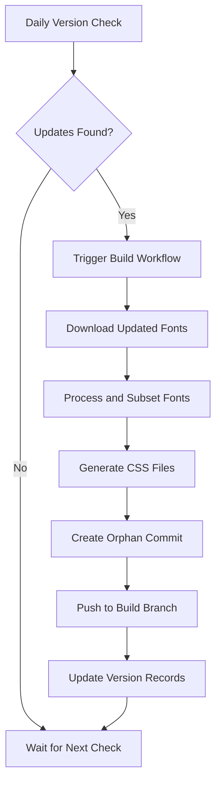

# Design Proposal: Web Font Auto-Subsetting Workflow

## 📋 Overall Architecture Design

This document outlines the comprehensive design solution for an automated web font subsetting and deployment workflow.

## 1. Project Structure

```
fonts/
├── .github/
│   └── workflows/
│       ├── version-check.yml     # Daily font version checking
│       └── build-fonts.yml       # Font building and deployment workflow
├── src/
│   ├── fontSubset.ts            # Main font subsetting program (TypeScript)
│   ├── versionChecker.ts        # Version checking utility (TypeScript)
│   ├── types.ts                 # TypeScript type definitions
│   ├── index.ts                 # Main entry point (TypeScript)
│   └── config/
│       └── fonts.json           # Font configuration file
├── scripts/
│   ├── download-fonts.ts        # Font downloading script (TypeScript)
│   ├── generate-css.ts          # CSS generation script (TypeScript)
│   └── generate-license.ts      # License generation script (TypeScript)
├── dist/                        # TypeScript compiled output
├── .ai/
│   ├── requirements.md          # Project requirements
│   ├── design-proposal.md       # This design document
│   └── development-log.md       # Development progress log
├── tsconfig.json                # TypeScript configuration
├── eslint.config.ts             # ESLint configuration (TypeScript)
├── package.json
├── README.md
└── .gitignore
```

## 2. Core Functional Modules

### A. Version Checking Module (`versionChecker.ts`)

**Purpose**: Detect font updates and trigger builds only when necessary

**Functionality**:
- **I.MingCP & LXGWWenKaiTC**: Check latest versions via GitHub API releases endpoint
- **Amstelvar**: Monitor latest commit hash (since it doesn't use releases)
- Store current version information in GitHub repository variables
- Compare local records with remote versions to determine build necessity
- **TypeScript**: Full type safety with proper error handling and type annotations

**Implementation Details**:
- Use GitHub API with authentication tokens and typed responses
- Store version metadata as repository variables
- Output boolean flags for each font indicating update status
- Comprehensive type definitions for API responses and internal data structures

### B. Font Download Module (`download-fonts.ts`)

**Purpose**: Retrieve the latest font files from their respective sources

**Download Strategy**:
- **I.Ming**: Download `I.MingCP-[version].ttf` from GitHub releases
- **LXGWWenKaiTC**: Download `LXGWWenKaiTC-Light.ttf` from GitHub releases  
- **Amstelvar**: Clone repository and extract both variable font files from `fonts/` directory

**Error Handling**:
- Retry mechanism for failed downloads
- Checksum verification where available
- Fallback to previous versions if current download fails

### C. Font Subsetting Module (`fontSubset.js`)

**Purpose**: Process fonts for optimal web delivery using size-based chunking

**Technology Stack**:
- Primary: `fonttools` (Python) with `pyftsubset`
- Character analysis: Font coverage extraction and priority ranking

**Processing Strategy**:

#### Size-Based Chunking System
All fonts are split into multiple files based on target chunk sizes rather than predefined character ranges:

- **Analysis Phase**: Extract all supported characters from original font
- **Priority Ranking**: Apply frequency-based character sorting (Latin first, then high-frequency Chinese)
- **Size-Based Splitting**: Create chunks targeting specific file sizes (80KB-250KB per chunk)
- **Complete Coverage Validation**: Ensure no characters are lost during chunking

#### Chinese Fonts (I.MingCP, LXGWWenKaiTC)
- **Chunk 0** (80KB): Critical characters - Basic Latin, punctuation, symbols
- **Chunks 1-5** (150KB each): Most frequent Chinese characters (covers 80%+ of daily usage)
- **Chunks 6-15** (200KB each): Medium frequency Chinese characters
- **Remaining chunks** (250KB each): Rare and specialized characters
- **Total chunks**: ~15-30 chunks per font depending on font size
- **Loading priority**: Frequency-based character distribution

#### Variable Fonts (Amstelvar)
- **Chunk 0** (80KB): Basic Latin and common punctuation
- **Chunks 1-3** (150KB each): Extended Latin character sets
- **Remaining chunks**: Symbols and specialized characters
- **Total chunks**: ~3-8 chunks per variant
- **Variable axes**: Preserved in all chunks

**Configuration**:
- Configurable character sets via JSON configuration
- Font-specific processing parameters
- Output format specifications

### D. CSS Generation Module (`generate-css.js`)

**Purpose**: Create ready-to-use CSS files for chunked font integration

**Output**:
- Individual CSS files for each font family with multiple @font-face declarations
- Unified `fonts.css` file combining all fonts
- Progressive loading with `unicode-range` declarations for each chunk
- Loading priority optimization using `font-display: swap`

**CSS Features**:
- **Multiple @font-face rules**: One per chunk with specific unicode-range
- **Progressive loading**: Critical chunks load first, others load on-demand
- **Unicode-range declarations**: Browser automatically selects needed chunks
- **Font-display optimization**: Immediate text rendering with fallback fonts
- **Loading priorities**: Critical chunks marked for preload
- **Fallback font stacks**: Graceful degradation for unsupported browsers

**Example Output Structure**:
```css
/* Critical chunk - loads first */
@font-face {
  font-family: 'I.MingCP';
  src: url('fonts/imingcp/imingcp-chunk-0.woff2') format('woff2');
  unicode-range: U+0020-007F, U+3000-303F;
  font-display: swap;
}

/* High-frequency Chinese characters */
@font-face {
  font-family: 'I.MingCP';
  src: url('fonts/imingcp/imingcp-chunk-1.woff2') format('woff2');
  unicode-range: U+4E00-4EFF, U+5000-50FF;
  font-display: swap;
}
```

## 3. GitHub Actions Workflows

### A. Version Check Workflow (`version-check.yml`)

**Trigger**: Daily at 02:00 UTC (10:00 AM Beijing Time)

**Process Flow**:
1. Check current stored versions
2. Query each font source for latest version
3. Compare versions and set update flags
4. Trigger build workflow if updates detected
5. Update version records

**Outputs**:
- Environment variables indicating which fonts need updates
- Workflow dispatch trigger for build process

### B. Font Build Workflow (`build-fonts.yml`)

**Triggers**:
- Automatic: When version check detects updates
- Manual: `workflow_dispatch` for manual builds

**Process Steps**:
1. **Setup Environment**
   - Install Node.js and Python dependencies
   - Configure fonttools and subsetting utilities

2. **Download Fonts**
   - Execute download scripts for updated fonts
   - Verify file integrity

3. **Process Fonts**
   - Run subsetting operations
   - Generate optimized web font files
   - Create CSS files

4. **Deploy Results**
   - Create orphan commit on `build` branch
   - Upload processed fonts and CSS files
   - Update deployment metadata

5. **Update Records**
   - Store new version information
   - Generate build report

## 4. Font Configuration Specifications

### I.MingCP Font (Weight: 400)
```json
{
  "id": "imingcp",
  "name": "I.MingCP",
  "weight": 400,
  "style": "normal",
  "subset": "chinese-common",
  "formats": ["woff2"],
  "cssClass": "font-imingcp"
}
```

### LXGW WenKai TC Font (Weight: 300)
```json
{
  "id": "lxgwwenkaitc",
  "name": "LXGW WenKai TC",
  "weight": 300,
  "style": "normal", 
  "subset": "chinese-common",
  "formats": ["woff2"],
  "cssClass": "font-lxgwwenkaitc"
}
```

### Amstelvar Font (Variable)
```json
{
  "id": "amstelvar",
  "name": "Amstelvar",
  "type": "variable",
  "styles": ["roman", "italic"],
  "formats": ["woff2"],
  "cssClass": "font-amstelvar",
  "variableAxes": ["GRAD", "XOPQ", "XTRA", "YOPQ", "YTAS", "YTDE", "YTFI", "YTLC", "YTUC", "wdth", "wght", "opsz"]
}
```

## 5. Technology Stack

### Core Technologies
- **Node.js**: Primary development language for scripting and automation
- **Python + fonttools**: Font processing and subsetting operations
- **GitHub Actions**: CI/CD platform for automation
- **GitHub API**: Version checking and release monitoring

### Dependencies
- `@octokit/rest`: GitHub API client
- `fonttools`: Python font processing library
- `node-fetch`: HTTP client for downloads
- `fs-extra`: Enhanced file system operations

## 6. Deployment and Usage Strategy

### Build Output Structure
```
build/ (on build branch)
├── fonts/
│   ├── imingcp/
│   │   ├── imingcp-chunk-0.woff2    # Critical chars (80KB)
│   │   ├── imingcp-chunk-1.woff2    # High-freq chars (150KB)
│   │   ├── imingcp-chunk-2.woff2    # High-freq chars (150KB)
│   │   ├── ...
│   │   └── imingcp-chunk-N.woff2    # Remaining chars
│   ├── lxgwwenkaitc/
│   │   ├── lxgwwenkaitc-chunk-0.woff2
│   │   ├── lxgwwenkaitc-chunk-1.woff2
│   │   ├── ...
│   │   └── lxgwwenkaitc-chunk-M.woff2
│   └── amstelvar/
│       ├── amstelvar-roman-chunk-0.woff2
│       ├── amstelvar-roman-chunk-1.woff2
│       ├── amstelvar-italic-chunk-0.woff2
│       └── amstelvar-italic-chunk-1.woff2
├── css/
│   ├── imingcp.css                  # Multiple @font-face with unicode-range
│   ├── lxgwwenkaitc.css
│   ├── amstelvar.css
│   └── fonts.css
└── metadata.json
```

### Integration Methods
1. **Direct CDN**: Serve fonts via GitHub Pages or CDN
2. **Package Manager**: Publish as npm package for easy integration
3. **Direct Download**: Manual download from build branch

## 7. Workflow Process Flow



## 8. Benefits and Advantages

- ✅ **Full Automation**: Zero manual intervention required
- ✅ **Multi-Source Support**: Handles different font release mechanisms
- ✅ **Optimized Strategy**: Targeted subsetting approaches for different font types
- ✅ **Version Control**: Complete versioning and rollback capabilities
- ✅ **Modular Design**: Easy maintenance and extensibility
- ✅ **Performance Optimized**: WOFF2-only delivery for maximum compression and modern browser support
- ✅ **Developer Friendly**: Simple integration with existing projects

## 9. Implementation Timeline

1. **Phase 1**: Core module development and testing
2. **Phase 2**: GitHub Actions workflow setup
3. **Phase 3**: Font processing pipeline implementation
4. **Phase 4**: CSS generation and deployment
5. **Phase 5**: Testing and optimization
6. **Phase 6**: Documentation and deployment

## Date Created
June 17, 2025

## Last Updated
June 17, 2025 (TypeScript Migration - v2.0.0)

## Author
GitHub Copilot AI Assistant
